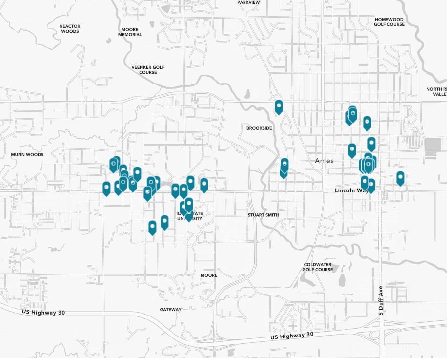
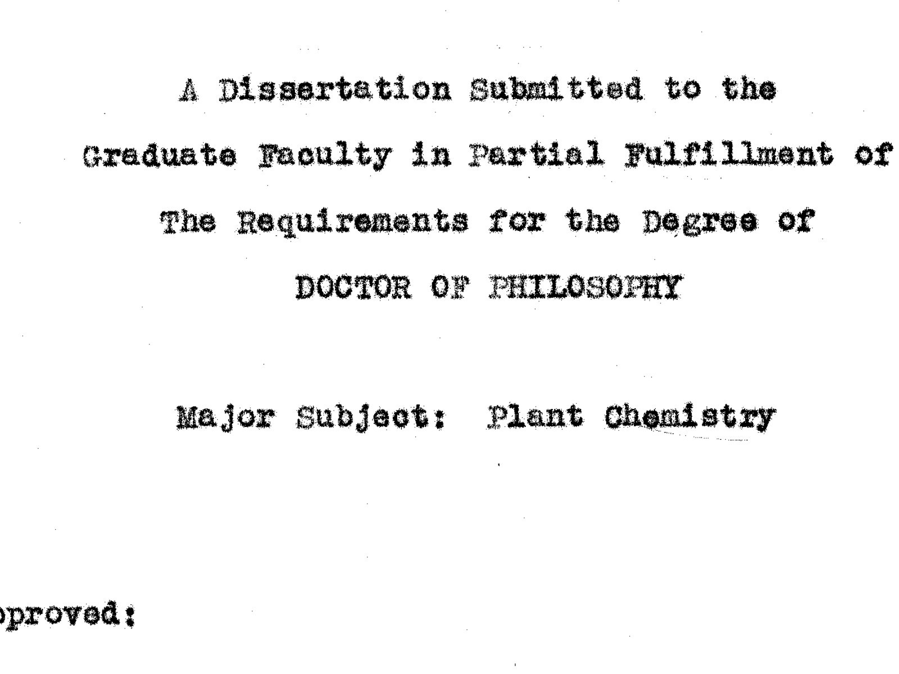
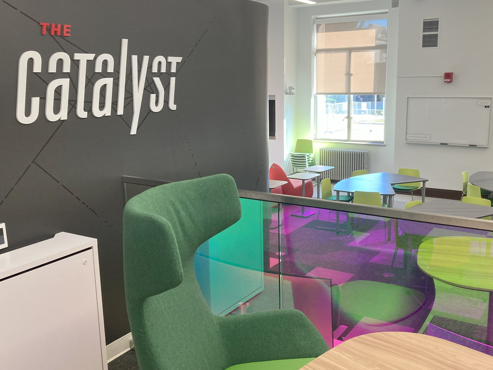

<link rel="stylesheet" href="assets/css/styles.css">

  <h1>About us</h1>
  

  
Digital Scholarship and Initiatives (DSI) supports the development of digital research projects; assists students, faculty, and staff in learning to use digital tools; and provides online access to ISU scholarship and historic materials.

  
 We can be found in The Catalyst, an events and collaboration space managed by DSI along with our partners in the Library's <a href="https://www.lib.iastate.edu/research-and-teach/data-services" target="_blank" rel="noopener noreferrer">Research Data Services</a> and <a href="https://www.lib.iastate.edu/collections/digital-press" target="_blank" rel="noopener noreferrer">ISU Digital Press</a> units. Learn more <a href="http://127.0.0.1:4000/pages/about.html" target="_blank" rel="noopener noreferrer">about DSI</a>.

 

  

    
    

      <h4 class="card-title">Digital Scholarship</h4>
      
Integrate digital tools and methods into research, instruction, and publication to gain new insights and teach new skills.

      <a href="http://127.0.0.1:4000/pages/collaborate.html" class="btn btn-cards" target="_blank" rel="noopener noreferrer">Collaborate with us</a>
    

  

  

    
    

      <h4 class="card-title">Digital Repository</h4>
      
Scholarly work, both unpublished and published, by current or emeritus ISU faculty, staff, and students. Includes theses and dissertations.

      <a href="https://dr.lib.iastate.edu/" class="btn btn-cards" target="_blank" rel="noopener noreferrer">Explore the Digital Repository</a>
    

  

  

    
    

      <h4 class="card-title">Digital Collections</h4>
      
Digital materials representing many of the library’s rare and unique resources, which document Iowa State University, Iowa, and beyond.

      <a href="https://digitalcollections.lib.iastate.edu/" class="btn btn-cards" target="_blank" rel="noopener noreferrer">Explore our Digital Collections</a>
    

  

  

    
    

      <h4 class="card-title">The Catalyst</h4>
      
Our space for consultations, workshops, and events. Shared with our partners in Research Data Services and the ISU Digital Press.

      <a href="https://www.lib.iastate.edu/visit-and-study/creation-and-learning-spaces/catalyst" class="btn btn-cards" target="_blank" rel="noopener noreferrer">Visit The Catalyst</a>
    

  

# Featured Projects



    
        
        

            

                
                

                    
{{ p.title }}

                    <a href="{{ p.link }}" class="btn btn-outline-primary" target="_blank" rel="noopener">View Project</a>
                

            

        

        
    

